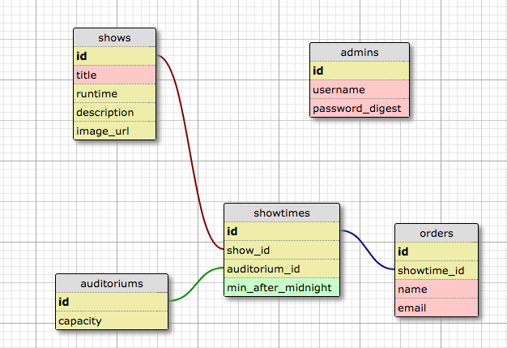

# README

This is a Rails 5 website that would allow you to buy movie tickets.

This page is hosted on heroku at [fundango.herokuapp.com](fundango.herokuapp.com)

The only pages that a customer can visit are / and /showtimes/showtime_id/orders/new.

Admins can visit any page.

The site uses rails action mailer to send confirmation emails once a purchase has been made.

Bootstrap was used for the sites styling.